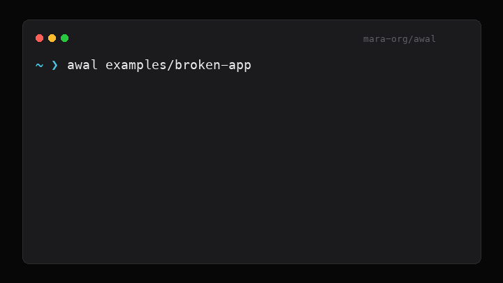

# Awal

README truth check for developer onboarding.

Awal is a small local CLI that scans the README and compares it with the repo surface to ensure the first-run path works: missing package scripts, npm/yarn drift, missing compose files, stale env files, and broken Docker commands.

No command execution. No network calls. No cloud upload. No LLM.

## Demo



## Install

```bash
python3 -m pip install -e .
```

Later, if the package earns it:

```bash
pip install awal
```

## Quick Start

```bash
awal .
awal scan ./some-repo
awal examples/broken-app
```

Run without installing:

```bash
PYTHONPATH=src python3 -m awal examples/broken-app
```

## Output Formats

```bash
awal . --format text
awal . --format json --output awal-report.json
awal . --format csv --output awal-report.csv
awal . --format sarif --output awal.sarif
```

Exit codes:

- `0`: pass
- `1`: review findings found
- `2`: blocked by `--fail-on`

## Checks

Awal looks for common README drift issues:

- README commands that call missing `package.json` scripts.
- `npm`, `pnpm`, `yarn`, or `bun` drift against the lockfile.
- `npm test` pointing to the default fake test script.
- Docker Compose commands with no compose file.
- Docker build commands with no Dockerfile.
- Python install commands with no `pyproject.toml`, `setup.py`, or `requirements.txt`.
- README `.env` instructions with no `.env.example`.
- Env vars used in code but missing from `.env.example`.
- Secret-looking values committed inside example env files.
- README URLs whose port disagrees with the dev script.
- README commands that `cd` into folders that do not exist.
- Risky bootstrap commands like `curl | bash`, `chmod 777`, or destructive `rm`.

## UI

```bash
awal ui
```

Open `http://127.0.0.1:8774/` to type a local repo path and scan it.

## GitHub Action

Use Awal as a PR gate:

```yaml
name: Awal
on: [pull_request]
permissions:
  contents: read
jobs:
  readme-truth:
    runs-on: ubuntu-latest
    steps:
      - uses: actions/checkout@v4
      - uses: mara-org/awal@v0
        with:
          path: .
          fail-on: high
```

## Development

```bash
python3 -m unittest discover -s tests
python3 -m compileall src tests
python3 -m pip wheel . -w /tmp/awal-wheel
```

## Scope

Awal does not run your README commands. It statically checks whether the commands, files, env keys, package scripts, and ports mentioned in the README match what exists in the repo.

## About

Maintained by [mara](https://github.com/mara-org). Created by the CTO.
